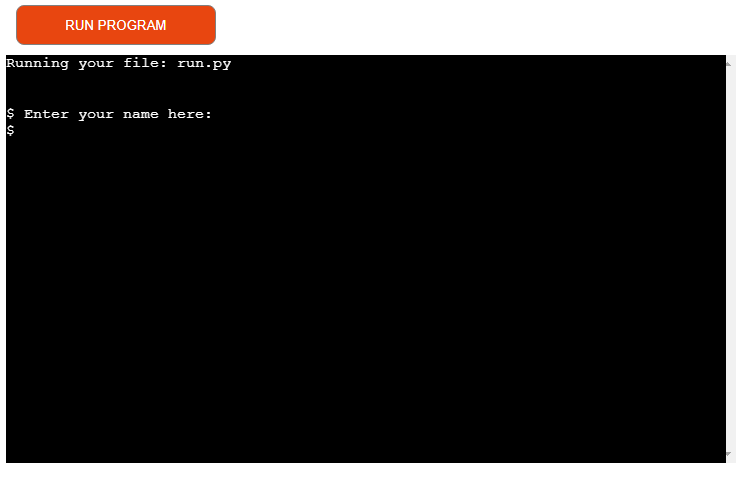
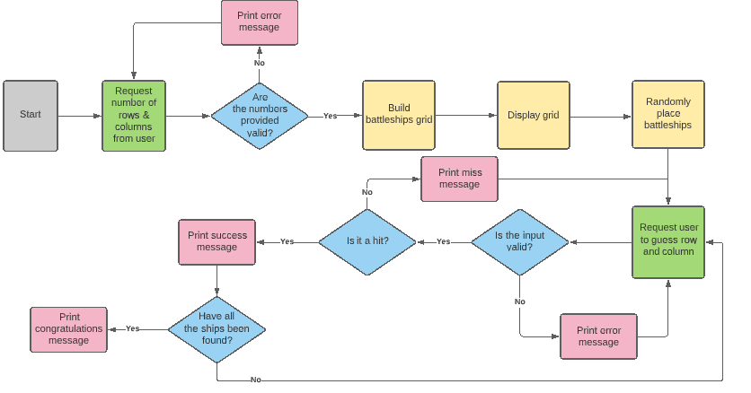
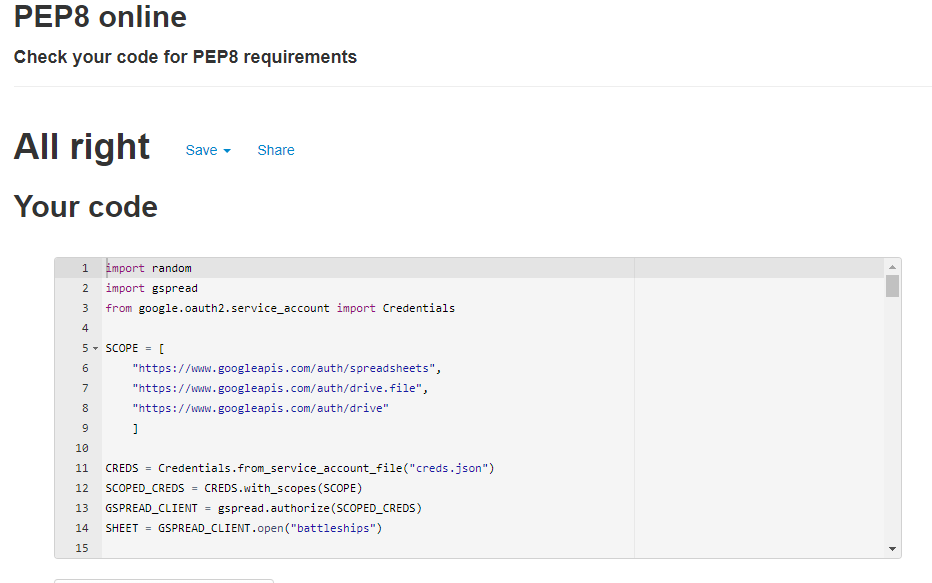

# Battleships

## Portfolio Project 3 - Python Essentials

The purpose of this project was to build an interactive logic game for a user to play against the computer.

# Table of Contents
1. [Link to app](https://github.com/Michelle3334/battleships#link-to-app)
2. [Features](https://github.com/Michelle3334/battleships#features)
3. [Technologies Used](https://github.com/Michelle3334/battleships#technologies-used)
4. [Testing](https://github.com/Michelle3334/battleships#testing)
5. [Deployment](https://github.com/Michelle3334/battleships#deployment)
6. [Credits](https://github.com/Michelle3334/battleships#credits)
7. [Acknowledgements](https://github.com/Michelle3334/battleships#acknowledgements)

# Link to app
The app can be found <a href="https://battleships-py.herokuapp.com/" target="_blank" rel="noopener">here</a>. (Note: Right click on link to open a new tab).

# Features
* The player can select grid size.
* The program warns the player if the input is invalid, and also if their input is off grid.
* The player inputs their name which is updated to a google sheet.
* Messages to the player are personalised with their name.
* The player is told what number player they are.

# Technologies Used:
### Programming Languages:
* Python
### Git
* Git was used for version control by utilizing the Gitpod terminal to commit to Git and Push to GitHub.
### Github
* GitHub is used to store the projects code after being pushed from Git.
### Lucidchart
* Lucidchart was used to map the workflow for the game.

# Testing
## Functionality testing
* Each piece of code was tested in Gitpod as well as in Python Tutor (where possible).
* Family members and friends were asked to test the app once the final product was deployed.
## Code Validation
* The code was checked using Pep8online checker.

# Deployment
The project was deployed to GitHub Pages using the following steps, I used Gitpod as a development environment where I commited all changes to git version control system. I used the push command in Gitpod to save changes into GitHub:

1. Log in to GitHub and locate the GitHub Repository.
2. At the top of the Repository, click on the "Settings" Button on the menu.
3. Scroll down the Settings page until you locate the "Pages" Section.
4. Under "Source", click the dropdown called "None" and select "Master Branch" and click on save.
5. The page will automatically refresh.
6. The now published site link shows at the top of the page.

The project was then deployed to Heroku using the following steps:

1. Log in to Heroku and add a new app.
2. Link the project from GitHub to Heroku.
3. Add the CREDS.JSON file to the ConfigVars in Settings.
4. Add the Python and NodeJS buildpacks.
5. Manually deploy the project (I used the manual deploy option in order to control what version was deployed).

# Credits
* The code for the structure of the grid was adapted from the below example (right click to open in new tab).
https://codereview.stackexchange.com/questions/122970/python-simple-battleship-game
* Stackoverflow was great resource for resolving questions I had. 

# Acknowledgements
* CSN tutors for their quick assistance.
* My mentor for support, advice and feedback.
* My family for their endless support, feedback and testing.